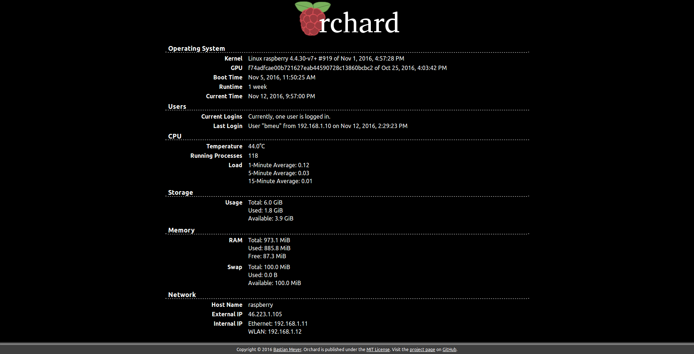

# Welcome to the Orchard!

Orchard is a web application designed for Raspberry Pi servers to monitor their status.
Have a look at it yourself:
 

## Features

Know what your Raspberry Pi is up to at an instance, from any device, without having to log in
via SSH:

* Display the most important system information of your Raspberry Pi in your browser
* Fully responsive web design for any device from your smartphone to your 4K TV
* Full English and German localizations
* Slim pages for quick loading without stressing your Raspberry Pi

## Getting Started
Please refer to the
["Getting Started" section in the documentation](https://orchard.readthedocs.io/en/master/gettingstarted.html)
for instructions on how to install Orchard on your Raspberry Pi.

## Documentation
The full documentation is available at [Read the Docs](https://orchard.readthedocs.io).

## License
Copyright &copy; 2016 [Bastian Meyer](http://www.bastianmeyer.eu). Orchard is licensed under the
[MIT License](http://www.opensource.org/licenses/MIT).
