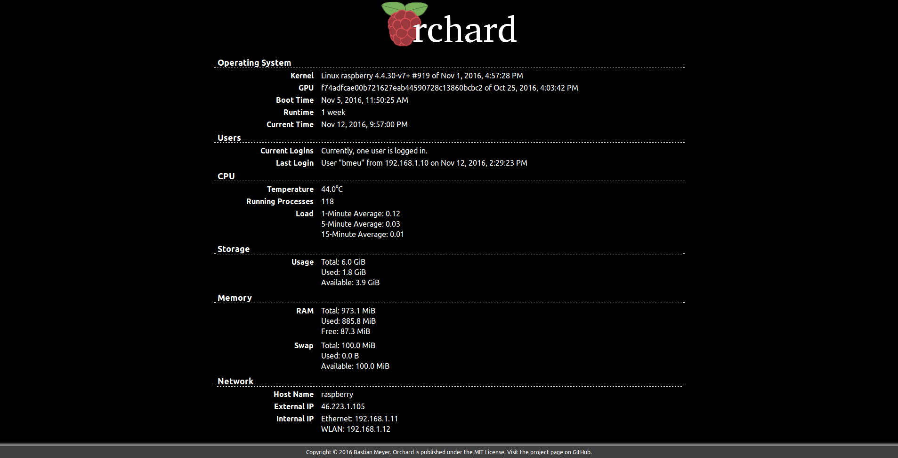

|projectname|
=============

|projectname| is a web application designed for Raspberry Pi servers to monitor their status.
Have a look at it yourself:

You are viewing the documentation for version |version| of |projectname|.

Features
--------

Know what your Raspberry Pi is up to at an instance, from any device, without having to log in
via SSH:

* Display the most important system information of your Raspberry Pi in your browser
* Fully responsive web design for any device from your smartphone to your 4K TV
* Full English and German localizations
* Slim pages for quick loading without stressing your Raspberry Pi

Content
-------

.. toctree::
   :maxdepth: 3

   gettingstarted
   userguide
   api
   changelog
   license

Copyright |copy| 2016 Bastian Meyer. |projectname| is licensed under the
`MIT License <http://www.opensource.org/licenses/MIT>`_.
